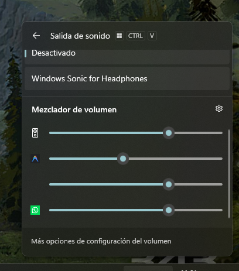

# 🔊 iFi Zen DAC Windows System Volume Fix

Este proyecto es una utilidad ligera en C++ diseñada para corregir y unificar el control de volumen del sistema en Windows cuando se utiliza un DAC **iFi Zen** (o dispositivos compatibles), sin depender de software de terceros.

---

## 📋 Tabla de Contenidos
- [¿Cuál es el problema?](#-cuál-es-el-problema)
- [Nuestra Solución](#-nuestra-solución)
- [Características Principales](#-características-principales)
- [Capturas de Pantalla](#-capturas-de-pantalla)
- [Instalación Rápida](#-instalación-rápida)
- [Compilación (Desarrolladores)](#-compilación-desarrolladores)
- [¿Cómo funciona técnicamente?](#-cómo-funciona-técnicamente)

---

## ❓ ¿Cuál es el problema?
Al utilizar un DAC USB externo como el **iFi Zen DAC** en Windows, el control de volumen maestro de Windows a menudo no escala de forma proporcional o directa el volumen de las sesiones de audio individuales de las aplicaciones (por ejemplo, Spotify, Chrome, Discord, etc.). Esto puede provocar que el sonido sea extremadamente fuerte en ciertas aplicaciones o que los controles de volumen multimedia del teclado no funcionen correctamente para controlar el nivel global de todas las aplicaciones de forma unificada.

## 💡 Nuestra Solución
Este programa es un servicio ligero que se ejecuta en segundo plano (en la bandeja del sistema o *system tray*):
1. **Detecta automáticamente** cuando tu iFi Zen DAC está activo como dispositivo por defecto.
2. **Escucha en tiempo real** los cambios del volumen maestro del sistema.
3. **Sincroniza y escala proporcionalmente** el volumen de cada sesión de audio individual activa en Windows a través de todos los endpoints de audio activos.
4. **Evita picos repentinos de sonido**: Al iniciar una nueva aplicación o reproducir audio, el programa ajusta instantáneamente su volumen inicial al nivel maestro actual para evitar explosiones de volumen.

---

## ✨ Características Principales
* **100% Nativo y Eficiente**: Escrito en C++17 moderno utilizando exclusivamente las APIs nativas de Windows Core Audio (MMDeviceAPI, WASAPI).
* **Consumo de recursos casi nulo**: Sin interfaces pesadas ni frameworks web; funciona como una aplicación Win32 optimizada e invisible en segundo plano.
* **Autorecuperación (Self-Healing)**: Si desconectas y vuelves a conectar el DAC, el servicio detecta el cambio automáticamente en un intervalo de 2 segundos y vuelve a acoplarse.
* **Menú en la Bandeja del Sistema**: Un icono discreto en la barra de tareas te permite pausar, reanudar, reiniciar o salir del servicio en cualquier momento.
* **Inicio con Windows**: Incluye un script de PowerShell para configurar la ejecución automática al iniciar sesión de forma sencilla.

---

## 📸 Capturas de Pantalla

### Menú Desplegable (Bandeja del Sistema)
El programa cuenta con un menú contextual simple y discreto al hacer clic derecho sobre el icono en la bandeja de entrada:

<p align="center">
  
</p>

### Muestra de Funcionamiento
Aquí se muestra cómo el servicio se ejecuta en segundo plano y realiza la sincronización en tiempo real:

<p align="center">
  
</p>

---

## 🚀 Instalación Rápida

Para instalar y configurar el servicio para que se inicie automáticamente con Windows:

1. Asegúrate de tener compilado el proyecto (ver sección [Compilación](#-compilación-desarrolladores)).
2. Abre **PowerShell** en la carpeta del proyecto.
3. Ejecuta el script de configuración de autostart:
   ```powershell
   .\Configure-Autostart.ps1
   ```
4. ¡Listo! El programa se iniciará en segundo plano y se agregará al registro de Windows (`HKCU:\Software\Microsoft\Windows\CurrentVersion\Run`) para iniciarse automáticamente en cada inicio de sesión.

*Para desinstalar y quitar el programa del inicio de Windows, simplemente ejecuta:*
```powershell
.\Configure-Autostart.ps1 -Uninstall
```

---

## 🛠️ Compilación (Desarrolladores)

Si deseas compilar el ejecutable por ti mismo, necesitas tener instalado [CMake](https://cmake.org/) y el compilador de C++ de Visual Studio (MSVC).

1. Abre una terminal de comandos (cmd o PowerShell) en la carpeta raíz del proyecto.
2. Crea el directorio de construcción:
   ```cmd
   mkdir build
   cd build
   ```
3. Genera los archivos del proyecto CMake:
   ```cmd
   cmake ..
   ```
4. Compila el ejecutable en modo Release:
   ```cmd
   cmake --build . --config Release
   ```
5. El ejecutable compilado `ifi_volume_sync.exe` se generará en la carpeta `build/` (o `build/Release/` según tu generador de CMake).

---

## ⚙️ ¿Cómo funciona técnicamente?
El programa utiliza las interfaces COM de Windows Core Audio:
* `IMMDeviceEnumerator` y `IMMNotificationClient` para detectar cambios en el dispositivo de reproducción por defecto.
* `IAudioEndpointVolume` e `IAudioEndpointVolumeCallback` para recibir notificaciones cuando cambias el volumen maestro de tu DAC.
* `IAudioSessionManager2` e `IAudioSessionEnumerator` para buscar y listar todas las aplicaciones que están reproduciendo sonido.
* `IAudioSessionNotification` para capturar en tiempo real la creación de nuevas sesiones de audio y escalarlas instantáneamente.

Para evitar bloqueos de hilos (deadlocks) en COM, la re-evaluación del dispositivo tras un cambio se delega a un hilo secundario independiente (`std::thread`).
